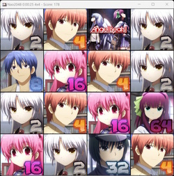

# java_2048

2048 Game in Java/Swing code.

Launch-able with UI or Console-only.

Shortcuts: 1rst letter of action
* n: New game
* q: Quit
* r: Random move
* shift + r: Toggle Auto Random move

Arrow keys to move.

In-Game Screenshot:  
